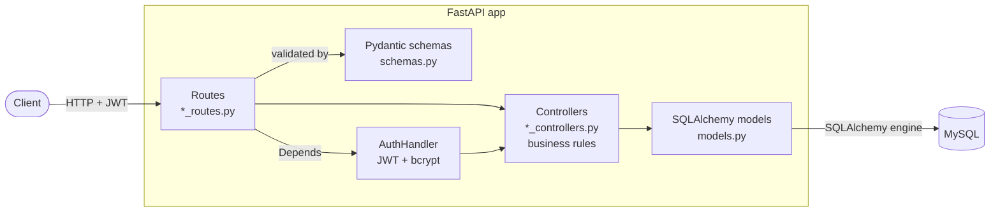
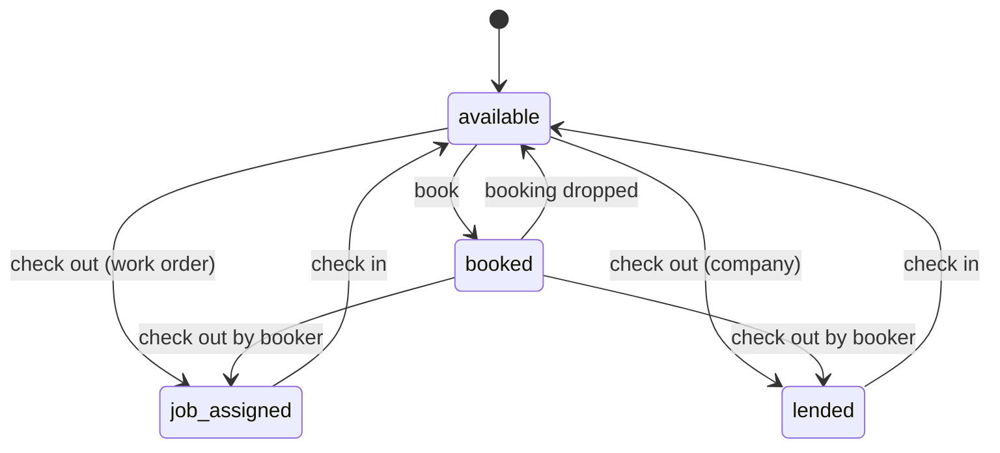

# Warehouse Management System API

A REST API for tracking tools and equipment across multiple warehouse branches: who has what, who booked it, when it is due back, and when it needs calibration. Built with **FastAPI**, **SQLAlchemy 2** and **MySQL**, with JWT authentication and an auditable history of every change.

> Interactive API docs are generated automatically at `/docs` (Swagger UI) and `/redoc` once the server is running.

## What it does

- **Multi-branch inventory.** Branches own employees and physical items. Each item has a unique company ID and serial number, and links to a shared *item detail* (name, category, datasheet, image).
- **Full item lifecycle.** Check out, check in and book items. A status state machine (`available`, `booked`, `lended`, `job assigned`, `out of service`, `calibration due`, `test and tag due`, `out of calibration`, `messing item`) decides which transitions are allowed:
  - Only available items, or items due for calibration or test-and-tag, can be booked or checked out.
  - A booked item can only be checked out by the employee who booked it.
  - Only the employee who checked an item out can check it back in.
- **Calibration tracking.** Items store calibration date, certificate link and out-of-calibration state.
- **Audit trail.** `ItemRecord` and `ItemDetailRecord` log who created, updated or deleted an entity, and when. Item comments can be flagged `needs_action`.
- **Authentication.** Employee signup and login with OAuth2 password flow, bcrypt password hashing, and JWT access tokens (60 min expiry) that are stored server-side so they can be revoked on sign-out.
- **Role-based access.** Employees have a `user` or `admin` role.
- **Reporting.** Per-branch inventory report endpoint, with PDF generation via ReportLab in progress.

## Tech stack

| Layer | Choice |
|---|---|
| Framework | FastAPI, Uvicorn |
| ORM / DB | SQLAlchemy 2.x, MySQL (`mysqlclient`) |
| Validation | Pydantic v2 |
| Auth | PyJWT, Passlib (bcrypt), OAuth2 password bearer |
| Reporting | ReportLab |
| Config | python-dotenv |

## Architecture

The code is split by resource, with a thin routing layer over a controller (business logic) layer:

```
src/
├── main.py                  # app factory, router registration, table creation
├── api/
│   ├── routes.py            # health check
│   ├── schemas.py           # Pydantic request/response models
│   ├── auth/                # JWT creation/validation, password hashing
│   ├── branch/              # routes + controllers
│   ├── employee/            # signup, login, signout, profile
│   ├── item/                # item CRUD, inventory report
│   ├── item_detail/         # item catalogue (shared metadata)
│   └── check_in_out_book/   # check-out, check-in, booking workflow
└── utils/
    ├── database.py          # engine + session dependency
    ├── models.py            # SQLAlchemy models and enums
    └── validators.py
```

### Layers



| Layer | Responsibility |
|---|---|
| Routes | HTTP concerns only: paths, params, response models, dependency injection |
| Schemas | Request and response validation (Pydantic v2) |
| Controllers | Business rules, status transitions, 404/400 errors |
| Models | Tables, relationships and enums |
| Utils | Engine, session dependency (`get_db`) |

### Request flow: checking out an item

1. `POST /items/check_out/{se_id}` is validated against `CheckOutCreate`.
2. The controller loads the item and the employee, and checks that the item's status allows the transition.
3. If the item was booked by this employee, the booking is dropped.
4. The item status becomes `lended` (external company) or `job assigned` (work order), and a `CheckOut` row is written with a timestamp.
5. Check-in later finds the open `CheckOut` for the same employee and item, marks it `returned`, and sets the item back to `available`.

### Item status state machine



`calibration due` and `test and tag due` items can still be booked or checked out. Other statuses (`out of service`, `messing item`, `out of calibration`) block both.

The ER diagram is in [schema.drawio](schema.drawio) (open it with the draw.io VS Code extension).

**Data model:** `Branch` → `Employee`, `Item` · `ItemDetail` → `Item` · `Item` → `CheckOut`, `CheckIn`, `Book`, `Comment`, `ItemRecord` · `Employee` → `Token`, `ItemDetailRecord`, and every action above.

## API overview

| Area | Endpoints |
|---|---|
| Health | `GET /` |
| Auth / employees | `POST /signup`, `POST /login`, `POST /signout`, `GET /employees/me`, `GET /employees` |
| Branches | `POST/GET /branches`, `PUT /branches/{name}`, `DELETE /branches`, `GET /branchEmployees/{name}`, `GET /branchItems/{name}` |
| Items | `POST /items`, `GET /items/`, `GET/PUT /items/{item_se_id}`, `GET /items/{branch_name}/pdf` |
| Item details | CRUD on the item catalogue |
| Check / book | `POST /items/check_out/{se_id}`, `POST /items/check_in/{se_id}`, `POST /items/book/{se_id}`, `GET /checkouts`, `GET /checkins` |

## Getting started

### Prerequisites

- Python 3.10+
- A running MySQL server
- MySQL client headers (needed to build `mysqlclient`)

### Setup

```bash
git clone https://github.com/SeragAmged/wareHouseApi.git
cd wareHouseApi
python -m venv .venv && source .venv/bin/activate
pip install -r requirements.txt
```

Create the database:

```sql
CREATE DATABASE wareHouseMS;
```

Create a `.env` file in the project root:

```env
SERVER_NAME=localhost
DATABASE_NAME=wareHouseMS
USER_NAME=your_user
PASSWORD=your_password
```

### Run

```bash
cd src
uvicorn main:app --reload
```

Tables are created automatically on startup. Open <http://127.0.0.1:8000/docs> to explore the API.

## Engineering notes

- **State-machine business rules** for check-out, check-in and booking live in the controller layer, keeping routes thin and the rules testable in one place.
- **Server-side token storage** gives real sign-out and revocation, which stateless JWTs do not.
- **Separate catalogue and instance models** (`ItemDetail` vs `Item`) avoid duplicating metadata across identical physical units.
- **Indexed lookups** on the fields queried most (IDs, emails, item and employee foreign keys, check-in/out dates).

